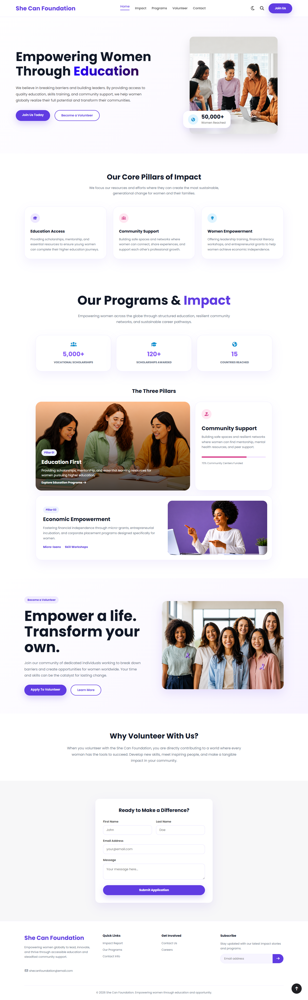
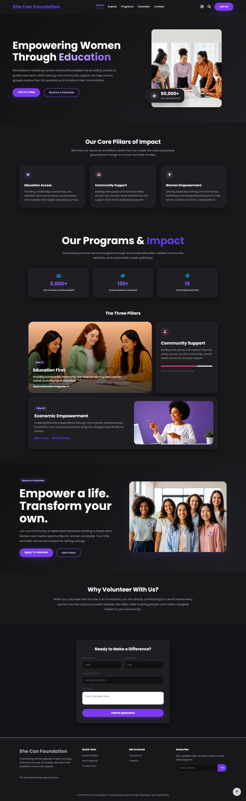

# 💜 She Can Foundation

A modern and responsive NGO website built to support and empower women through education, leadership, community support, and career opportunities.

---

# 🌍 Live Demo

🔗 Live Website  
https://kd-dev-alt.github.io/She-Can-Foundation/

🔗 GitHub Repository  
https://github.com/KD-dev-alt/She-Can-Foundation

---

# ✨ Features

- Responsive Design
- Dark Mode
- Interactive UI
- Modern Layout
- Scroll Reveal Animations
- Typing Text Effect
- Toast Notifications
- Animated Loader
- Active Navigation Links
- Scroll To Top Button
- Mobile Friendly Navigation
- Search Interaction

---

# 🛠️ Technologies Used


---

# 📸 Website Preview

## ☀️ Light Mode



---

## 🌙 Dark Mode



---

## 🏠 Hero Section

- Empowering women through education and opportunities
- Animated typing effect
- Interactive CTA buttons
- Floating impact card

---

## 🌟 Impact Section

- Education Access
- Community Support
- Women Empowerment
- Modern responsive cards

---

## 📚 Programs Section

- Education Programs
- Economic Empowerment
- Community Support
- Statistics Cards

---

## 🤝 Volunteer Section

- Volunteer CTA
- Responsive layout
- Interactive buttons
- Volunteer application form

---

# ⚙️ JavaScript Features

- Theme Toggle
- Search Toggle
- Mobile Navigation
- Scroll Reveal Effects
- Typing Animation
- Toast Notifications
- Loader Animation
- Active Navbar Highlight
- Scroll To Top Button

---

# 📱 Responsive Design

The website is fully responsive and optimized for:

- Desktop 💻
- Tablet 📱
- Mobile 📲

---

# 📂 Folder Structure

```bash
She-Can-Foundation/
│
├── index.html
├── style.css
├── script.js
├── README.md
│
├── images/
│   ├── hero-img.png
│   ├── program-1.png
│   ├── program-2.png
│   └── volunteer.png
│
├── preview/
│   ├── light-mode.png
│   └── dark-mode.png
│
└── icons/
    └── favicon.ico
```

---

# 🚀 Getting Started

## Clone Repository

```bash
git clone https://github.com/KD-dev-alt/She-Can-Foundation.git
```

---

## Open Project

Simply open:

```bash
index.html
```

in your browser.

---

# 🎯 Internship Task

This project was created as part of a Web Development Internship Task for She Can Foundation.

Additional features implemented:
- Responsive Design
- Dark Mode
- Animations
- Interactive UI
- Creative Layouts
- JavaScript Functionalities

---

# 👨‍💻 Author

## Keyur Dobariya

Frontend Developer

🔗 GitHub  
https://github.com/KD-dev-alt

🔗 LinkedIn  
https://www.linkedin.com/in/keyur-dobariya-dev

📧 Email  
keyur.dobariya.dev@gmail.com

---

# ⭐ Support

If you like this project, feel free to give it a ⭐ on GitHub.

---

# 📄 License

This project is created for educational and internship purposes.